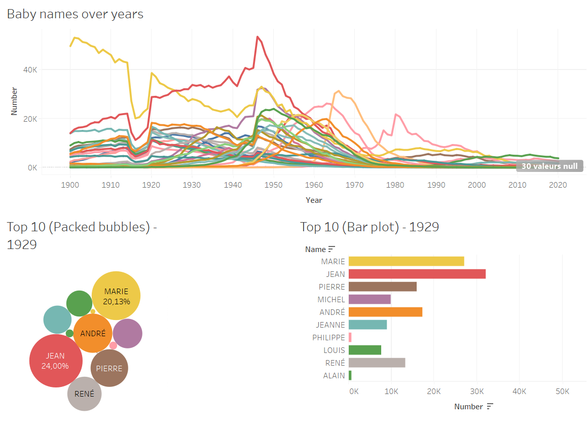
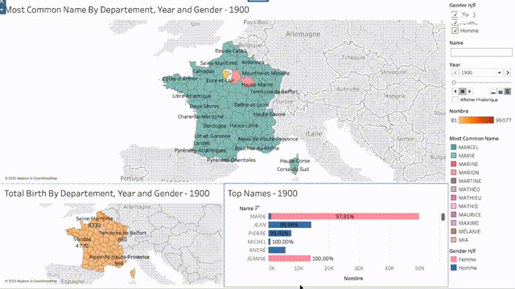

# Projet visualisation Groupe T

Groupe composé de : **Anh Phong NGUYEN**, **Arnaud GUETCHUENG**, **Donald ENDEL**, **Thomas LOISEAU**, **Mohamed SANAD**

Pour ouvrir le projet correspondant à la visualisation, il suffit de décompresser l’archive et d’exécuter les dossiers tableaux `.twb`

## Visualisation 1

Dans la première visualisation, nous avons considéré les 10 noms les plus populaires. En fait, nous avons pris tous les noms et les avons classés par la somme du nombre de naissances (de 1900 à 2020).

Ensuite, nous avons tracé trois graphiques. Le premier est un graphique linéaire qui nous montre l'évolution du nombre de naissances, pour ces 10 noms, au fil des années.

Le second est le tableau "Bulles emballées" où chaque cercle représente un nom, et sa taille est proportionnelle au nombre de naissances d'une année spécifique. 

Le troisième graphique est un graphique à barres, où l'axe des y représente les noms et l'axe des x représente le nombre de naissances.
Évidemment, les couleurs sont liées aux noms dans les trois parcelles (nous avons gardé les mêmes couleurs).

## Visualisation 2

Nous sélectionnons les dates que nous voulons afficher avec le filtre à glisser en haut à droite. Nous pouvons également filter les données par genre de la personne (homme / femme) ou par les premières lettres du prénom.

Cela affiche une carte de France indiquant pour chaque département le prénom le plus populaire pour l'année considéré. Nous utilisons 1 couleur par nom sur l'intégralité de la période (1900 à 2020). En survolant avec la souris, nous avons fait apparaitre les TopN des prénoms auxquels nous avons fait apparaître la proportion Homme/Femme pour le département concerné. Cela permet de monter qu'il existe des zones où les prénom restent populaires une longue période dans certaines zones géographiques.

De même, dans la partie inférieur de la visualisation, à droite nous faisons apparaitre le même TopN des prénoms  mais cette fois sur la France entière, permettant de constater les noms populaire sur tout le pays.

Enfin, (pour nous amusé), nous avons fait un autre carte montrant  le nombre de naissance par département et par année.

En conclusion, cette visualisation met en évidence un changement lent des prénoms les plus populaires au fil du temps, tout en nous permettant d'observer les années clés où les prénoms les plus fréquents connaissent des changements drastiques.
